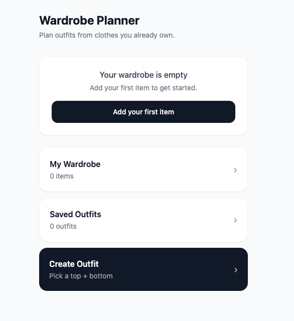
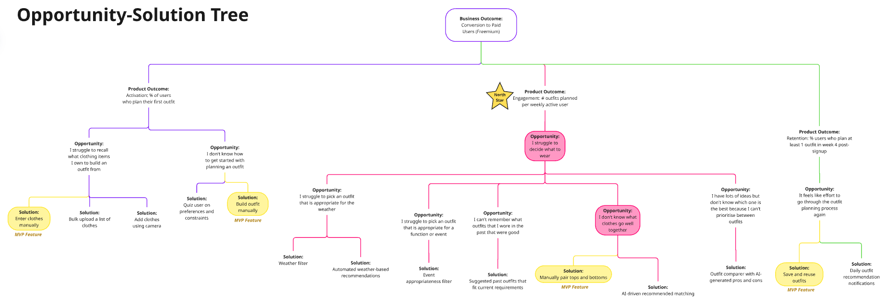
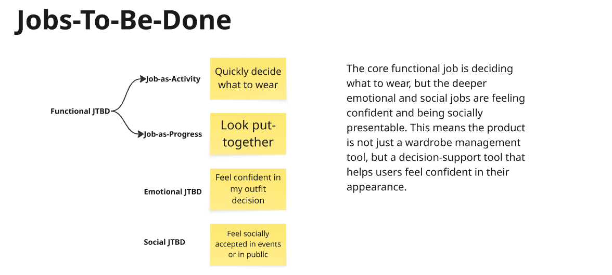
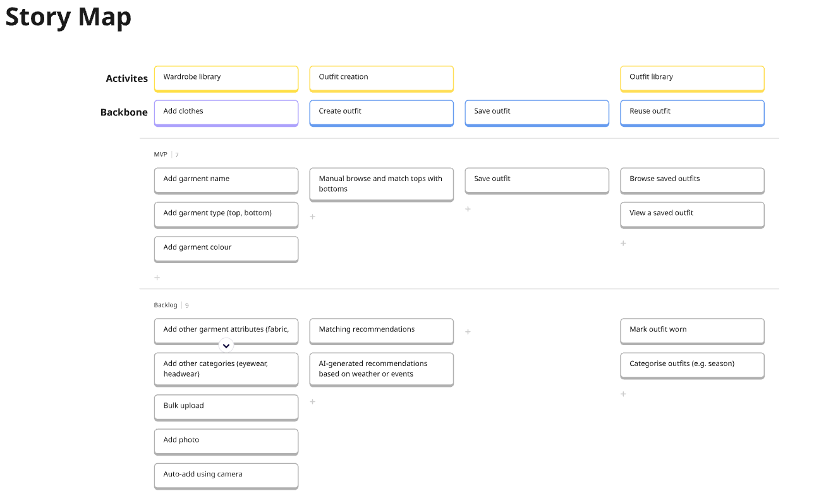
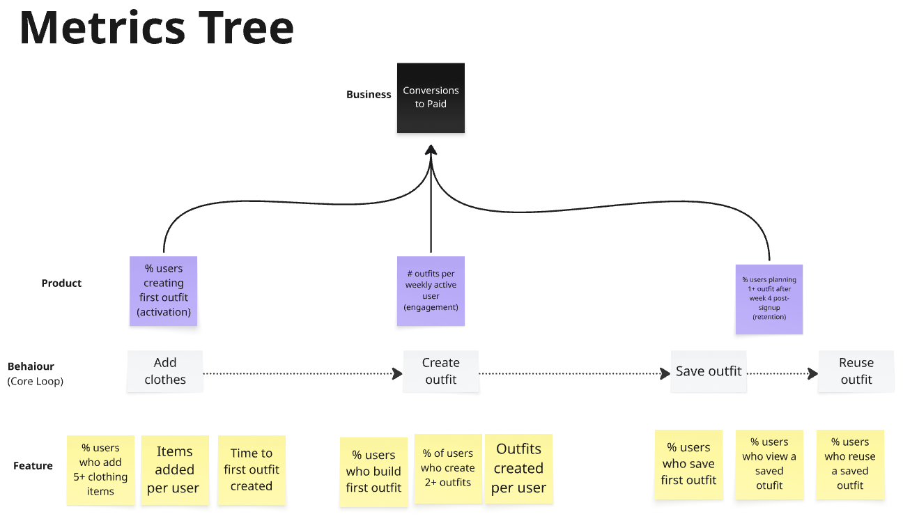
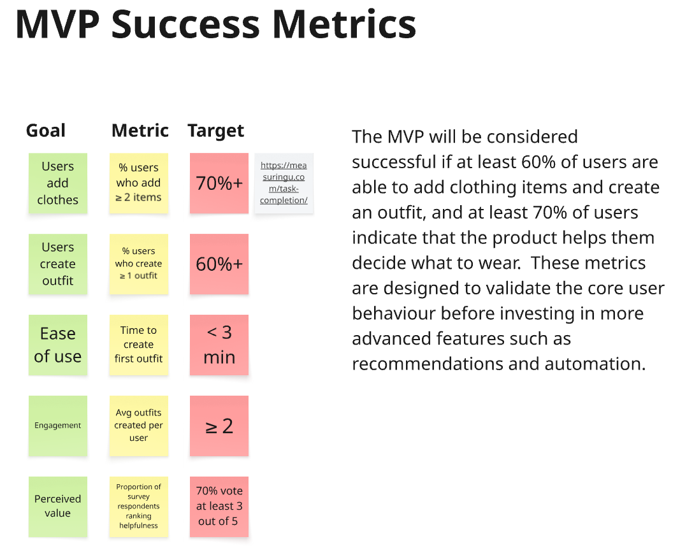
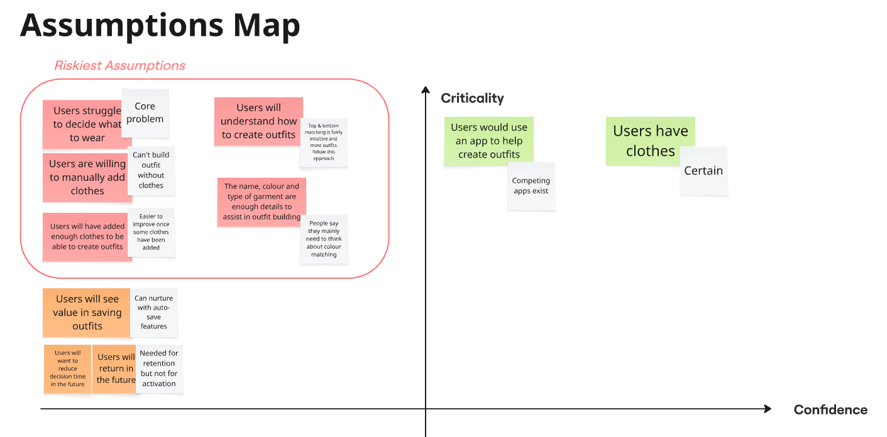
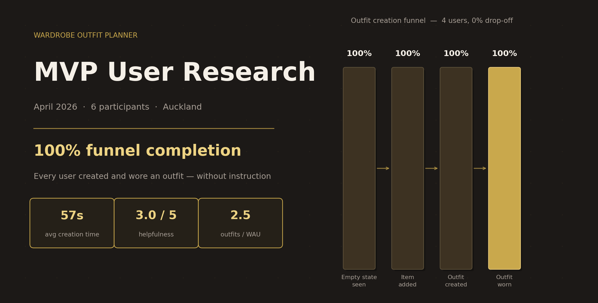

# Wardrobe Manager

A mobile-first web app for reducing outfit decision fatigue — built end-to-end as a PM case study: discovery → definition → build → user testing → findings.

**→ [wardrobe-manager-eight.vercel.app](https://wardrobe-manager-eight.vercel.app/)**



---

## Product Development Process

### Discovery

| Artefact | Preview |
|---|---|
| [Opportunity-Solution Tree](docs/images/opportunity_solution_tree.png) |  |
| [Jobs-To-Be-Done](docs/images/jobs_to_be_done.png) |  |
| [Story Map & MVP Scope](docs/images/story_map.png) |  |
| [Metrics Tree](docs/images/metrics_tree.png) |  |
| [MVP Success Metrics](docs/images/mvp_success_metrics.png) |  |
| [Assumptions Map](docs/images/assumptions_map.png) |  |

### Definition

| Document | Description |
|---|---|
| [PRD](docs/PRD.md) | Problem, target user, features, success metrics, open questions |
| [User Stories](docs/User_Stories.md) | Acceptance criteria for all five features |
| [Screen Structure](docs/Screens.md) | 8 screens, navigation flows, first-time user journey |
| [Database Schema](docs/DB_Schema.md) | Two-entity localStorage model with read/write patterns |
| [Tech Stack](docs/Tech_Stack.md) | Stack decisions and rationale |

### Measurement

| Artefact | Link |
|---|---|
| User Test Instructions | [User_Test.md](./docs/User_Test.md) |
| Survey | [Google Form](https://forms.gle/sfTz5pUTqtgJSzbY8) |
| Analytics | [Mixpanel Dashboard](https://mixpanel.com/p/PNCeGJf582SguPVnKLKaow) |
| Findings & Recommendations | [Full Report](docs/Findings_and_Recommendations.md) |

---

## Problem

Busy professionals waste daily time deciding what to wear — struggling to visualise combinations, forgetting outfits that worked, and applying real cognitive effort to a decision that doesn't warrant it.

**Hypothesis:** if users can add their clothes and build outfits, they'll reduce that effort and return to reuse what they've saved.

---

## Core Loop + North Star

**Add clothes → Create outfit → Save outfit → Reuse outfit**

Every feature decision was evaluated against this loop. If it didn't support it, it was cut.

**North Star Metric:** Outfits planned per Weekly Active User

---

## Target User

Working professionals who own a moderate wardrobe, want to look put-together, and don't want to think about it.

---

## MVP Scope

**In scope**
- Add clothing items (name, type, colour)
- View wardrobe grouped by type
- Create an outfit (1 top + 1 bottom)
- Save and reuse outfits

**Intentionally excluded**
- Photo uploads-
- AI recommendations
- Weather suggestions
- User accounts
- Cloud sync
- Social features

---

## Success Metrics

| Metric | Target |
|---|---|
| Users who add 2+ clothing items | ≥ 70% |
| Users who create 1+ outfit | ≥ 60% |
| Time to first outfit created | < 3 minutes |
| Average saved outfits per user | ≥ 2 |
| Users who say the app helps them decide what to wear | ≥ 70% |

---

## User Test Findings



> **6 participants · 12–13 April 2026 · Mobile web · Auckland**

The core hypothesis was validated. Every instrumented user completed the full loop without instruction. Average outfit creation time was **57 seconds** against a 3-minute target, with zero funnel drop-off across all four steps.

Two issues emerged.

**"Wear this" is broken by ambiguity.** Five of six users didn't understand what happened after tapping it. They expected a persistent, visible outcome. Without one, there's no observable loop closure and no reason to return.

> *"After clicking 'Wear this' I tried a few more times, and went back to the main page. Didn't end up figuring out what to do next or what this action means."*

**Photos are a functional gap, not a nice-to-have.** Four of six participants raised it unprompted. Text names alone aren't enough for users to reliably identify garments — which limits how much the app actually reduces decision effort, and likely explains the 3.0/5 helpfulness score.

> *"It would make it so much easier to scan your options and quickly find one you like instead of reading just text, especially for visual learners."*

The core experience landed as intended:

> *"The app was very intuitive — I didn't need any instructions to understand what I needed to do."*

| Metric | Result | Target | Met? |
|---|---|---|---|
| Users adding 2+ items | 4/4 (100%) | ≥ 70% | ✓ |
| Users creating at least one outfit | 4/4 (100%) | ≥ 60% | ✓ |
| Avg. outfit creation time | 57 seconds | < 3 min | ✓ |
| Outfits per Weekly Active User | 2.5 | ≥ 2 | ✓ |
| Avg. helpfulness (Likert) | 3.0 / 5 | ≥ 70% vote ≥ 3/5 | ✓ |

**Next steps:** fix "Wear this" confirmation state immediately. Ship photo upload in v2. The core loop is proven — the path to a 4+ helpfulness score runs through these two fixes.

*Full report: [`/docs/Findings_and_Recommendations.md`](docs/Findings_and_Recommendations.md)*

---

## Reflection & Key Learnings

**Speed of execution changed how I approached scoping.**
Because I could go from idea to working app quickly, I was more disciplined about what to include. Rather than exploring multiple directions, I focused on validating one hypothesis end to end.

**Upfront structure directly impacted build quality.**
Providing Claude Code with a PRD, user stories, screen structure, and schema made a measurable difference. Specific inputs produced aligned output. Vague inputs produced features that didn't fit the MVP.

**I chose to validate with a real product, not a prototype.**
Building with localStorage and a simple UI was as fast as high-fidelity prototyping, and produced more realistic signal. The core risk was behavioural — would users create and reuse outfits — not visual fidelity.

**AI accelerated the build, but not the thinking.**
Defining the problem, choosing the right opportunity (decision fatigue + outfit reuse), and aligning on a clear north star still required judgement. AI handled execution; direction required a human.

**Different tools played distinct roles.**
Claude Code was strongest for architecture and initial scaffolding. Cursor for iterative refinement. ChatGPT for early problem framing and artefact structure.

> As execution becomes increasingly commoditised, the quality of problem framing, prioritisation, and judgement becomes the primary driver of product impact.

---

## Future Improvements

- "Wear this" confirmation state (immediate)
- Photo uploads for clothing items
- Edit and delete items
- Multi-item outfits (jackets, shoes, accessories)
- Outfit tagging (work, casual, formal)
- Weather-based suggestions · Calendar integration · AI recommendations
- User accounts and cloud sync

---

## Tech Stack

| Layer | Technology |
|---|---|
| Frontend | React (Vite) |
| Styling | Tailwind CSS |
| State | React useState + useContext |
| Storage | Browser localStorage |
| Hosting | Vercel |
| Analytics | Mixpanel |

---

## Local Development

### Prerequisites
- Node.js v18+
- npm

### Setup

```bash
git clone https://github.com/zainazimullah/wardrobe-manager.git
cd wardrobe-manager
npm install
cp .env.example .env   # add your Mixpanel token
npm run dev            # http://localhost:5173
```

| Command | Description |
|---|---|
| `npm run dev` | Start dev server with hot reload |
| `npm run build` | Build for production → `dist/` |
| `npm run preview` | Serve the production build locally |