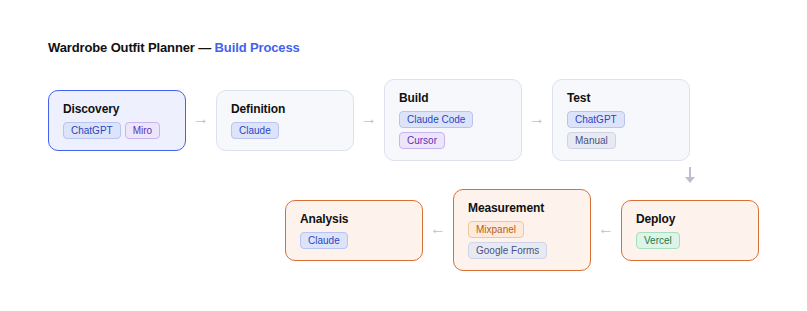

# Wardrobe Manager (MVP)

## Overview
Wardrobe Manager is a mobile-first web application designed to help users reduce decision fatigue when choosing what to wear by allowing them to create and reuse outfits from clothes they already own.

This project was built as a **Minimum Viable Product (MVP)** to validate a behavioural hypothesis and demonstrate an end-to-end product development process, from problem definition through to a working prototype.

---

## Prototype Preview


---

## Live App
https://wardrobe-manager-eight.vercel.app/

---

## Product Development Process

AI-Assisted Workflow:



Discovery (Screenshots from  [Miro Board](https://miro.com/app/board/uXjVGnSRt2Y=/?share_link_id=981380198776)):

- [Opportunity-Solution Tree](docs/images/opportunity_solution_tree.png)
- [Jobs-To-Be-Done](docs/images/jobs_to_be_done.png)
- [Story Map & MVP Scope](docs/images/story_map.png)
- [Metrics Tree](docs/images/metrics_tree.png)
- [MVP Success Metrics](docs/images/mvp_success_metrics.png)
- [Assumptions Map](docs/images/assumptions_map.png)
- [Assumption Tests](docs/images/assumption_tests.png)

Definition:

- [PRD](docs/PRD.md)
- [User Stories](docs/User_Stories.md)
- [Screen Structure](docs/Screens.md)
- [Database Schema](docs/DB_Schema.md)
- [Tech Stack](docs/Tech_Stack.md)

Measurement:

- [User Test Instructions](./docs/User_Test.md)
- [Survey](https://forms.gle/sfTz5pUTqtgJSzbY8)
- [Responses](docs/Survey_Responses.csv)
- [Analytics (Mixpanel)](https://mixpanel.com/p/PNCeGJf582SguPVnKLKaow)
- [Findings & Recommendations](docs/Findings_and_Recommendations.md)

---

## Problem
Deciding what to wear is a daily source of decision fatigue, particularly for busy professionals. Users struggle to visualise combinations, forget outfits that worked well in the past, and spend unnecessary time deciding what to wear each day.

This product explores whether a simple wardrobe and outfit planning tool can reduce the effort required to decide what to wear.

---

## Target User
The target user for this MVP is a working professional who:

- Owns a moderate wardrobe
- Wants to look put-together
- Does not want to spend much time deciding what to wear
- Is comfortable using a simple mobile web app as part of a daily routine

---

## Business Outcome
The long-term business goal for this product is **conversion to paid users** through a freemium model.

---

## Product Outcome (North Star Metric)
**North Star Metric: Outfits planned per Weekly Active User**

This metric was chosen because it represents the core value of the product: helping users decide what to wear by planning outfits.

If users repeatedly plan outfits, the product is delivering value. If the product delivers value, users are more likely to return and eventually convert to paid users.

---

## Product Strategy
To drive the North Star metric, the product focuses on enabling and reinforcing a single core behaviour loop:

**Add clothes → Create outfit → Save outfit → Reuse outfit**

Each step in this loop reinforces repeat usage and reduces the effort required to decide what to wear in the future. Increasing the frequency of this loop directly drives the North Star metric (Outfits planned per Weekly Active User).

The MVP was intentionally scoped to support this loop and exclude features that do not directly support this behaviour.

---

## Hypothesis
*If users can easily add their clothes and combine them to create outfits, they will reduce the time and effort required to decide what to wear. If this is true, users will save outfits and return to reuse them or create more.*

This MVP was built to test this hypothesis.

---

## MVP Scope
The MVP includes only the core functionality required to test the hypothesis:

- Add clothing items (name, type, colour)
- View wardrobe items
- Create an outfit (1 top + 1 bottom)
- Save outfits
- View saved outfits
- Reuse a saved outfit

The following were intentionally **out of scope** for the MVP:
- AI outfit recommendations
- Weather-based suggestions
- Social features
- Photo uploads
- Shopping integrations
- User accounts
- Cloud sync

These features may be explored after validating the core behaviour.

---

## Success Metrics
The MVP will be considered successful if the following targets are met during testing:

- ≥ 70% of users add 2 or more clothing items
- ≥ 60% of users create at least one outfit
- Time to first outfit created < 3 minutes
- Average saved outfits per user ≥ 2
- ≥ 70% of users say the app helps them decide what to wear

These metrics are designed to validate the core behaviour before investing in more advanced features.

---

## Tech Stack

| Layer | Technology |
|------|------------|
| Frontend | React (Vite) |
| Styling | Tailwind CSS |
| State Management | React useState + useContext |
| Data Storage | Browser localStorage |
| Hosting | Vercel |
| Analytics | Mixpanel |

The app uses **localStorage** instead of a backend to keep the MVP lightweight and fast to build.

---

## User Test Findings - Executive Summary


> **6 participants · 12–13 April 2026 · Mobile web · Auckland**

The first round of user testing validated the core hypothesis. Every instrumented user completed the full loop without instruction, average outfit creation time was **57 seconds** (target: under 3 minutes), and the Mixpanel funnel showed zero drop-off across all four steps.

Two issues need fixing before wider rollout.

**"Wear this" is broken by ambiguity.** Five of six users didn't understand what happened after tapping it. They expected a visible, persistent outcome — a badge, a confirmed state. Without one, there's no observable loop closure and no reason to return. This is the highest-priority fix.

> *"After clicking 'Wear this' I tried a few more times, and went back to the main page. Didn't end up figuring out what to do next or what this action means."*

**Photos are a functional gap, not a nice-to-have.** Four of six participants flagged it independently. Users can't reliably recall garments from text names alone, which limits how much the app actually reduces decision effort — and likely explains the 3.0/5 helpfulness score despite strong funnel performance.

> *"It would make it so much easier to scan your options and quickly find one you like instead of reading just text, especially for visual learners."*

On the positive side, the core loop landed exactly as intended:

> *"The app was very intuitive — I didn't need any instructions to understand what I needed to do."*

| Metric | Result | Target |
|---|---|---|
| Users adding 2+ items | 4/4 (100%) | ≥70% |
| Users creating at least one outfit | 4/4 (100%) | ≥60% |
| Avg. outfit creation time | 57 seconds | Under 3 min |
| Outfits per Weekly Active User | 2.5 | ≥2 |
| Avg. helpfulness (Likert) | avg 3.0 / 5 | ≥70% vote ≥3/5 |

**Next steps:** Add a visible confirmation state to "Wear this" immediately. Ship photo upload in v2. The core loop is proven — the path to a 4+ helpfulness score runs through these two fixes.

---

*Full report and analytics in [`/docs/Findings_and_Recommendations.md`](docs/Findings_and_Recommendations.md).*

---

## Reflection & Key Learnings

Building this MVP showed how AI tools change how products get built, while reinforcing what still requires deliberate product thinking.

**Speed of execution changed how I approached scoping**  
Because I could go from idea to a working app quickly, I was more disciplined about scoping the MVP around the core behaviour loop: add clothes → create outfit → save → reuse. Rather than exploring multiple directions, I focused on validating a single hypothesis end to end with a real product.

**Upfront structure directly impacted build quality**  
Providing Claude Code with clear inputs such as the PRD, user stories, screen structure, database schema, and tech stack made a clear difference. When inputs were specific, the output aligned with the intended user journey. When they were vague, it introduced unnecessary features or decisions that didn’t fit the MVP.

**I chose to validate with a real product, not a prototype**  
For this problem, building the actual app using localStorage and a simple UI was as fast as creating a high fidelity prototype, and gave more realistic validation. This worked because the core risk was behavioural, whether users would create and reuse outfits, not pixel level UX.

**AI accelerated the build, but not the thinking**  
The hardest part was still defining the problem, choosing the right opportunity such as focusing on decision fatigue and outfit reuse, and aligning on a clear success metric like outfits planned per WAU. AI helped execute quickly, but direction still required judgement.

**Different tools played distinct roles in the workflow**  
Claude Code was most effective for architecting the app and scaffolding the initial implementation. Cursor was more useful for iterative refinement such as improving flows and making targeted changes. ChatGPT was strongest in the early stages for framing the problem and structuring artefacts.

**End to end ownership improved clarity and speed**  
Taking this from problem definition to MVP to live deployment tightened feedback loops and made trade offs more explicit, such as using localStorage instead of a backend and limiting outfits to one top and one bottom. This helped keep the focus on validating the core behaviour.

> As execution becomes increasingly commoditised, the quality of problem framing, prioritisation, and judgement becomes the primary driver of product impact.

---

## Future Improvements (Post-MVP)
If the MVP validates the hypothesis, potential future features include:

- Edit and delete clothing items
- Multi-item outfits (jackets, shoes, accessories)
- Outfit tagging (work, casual, formal, etc.)
- Weather-based outfit suggestions
- Calendar integration
- Photo uploads for clothing items
- User accounts and cloud sync
- AI outfit recommendations

---

## Project Status
**Status:** Shipped (MVP)

---

## Local Development

### Prerequisites
- [Node.js](https://nodejs.org/) v18 or higher
- npm (bundled with Node.js)

### Setup

1. Clone the repository
   ```bash
   git clone https://github.com/zainazimullah/wardrobe-manager.git
   cd wardrobe-manager
   ```

2. Install dependencies
   ```bash
   npm install
   ```

3. Configure environment variables
   ```bash
   cp .env.example .env
   ```
   Open `.env` and replace `your_token_here` with your [Mixpanel project token](https://mixpanel.com). Analytics events will be silently skipped if this is left blank.

4. Start the development server
   ```bash
   npm run dev
   ```
   The app will be available at `http://localhost:5173`.

### Other commands

| Command | Description |
|---------|-------------|
| `npm run dev` | Start local dev server with hot reload |
| `npm run build` | Build for production (outputs to `dist/`) |
| `npm run preview` | Serve the production build locally |