# AI Wardrobe Manager

A mobile-first web app for reducing outfit decision fatigue. Built end-to-end as a PM case study over two iterations: discovery → definition → build → user testing → findings → a second, evaluated iteration (V2).

**→ [wardrobe-manager-eight.vercel.app](https://wardrobe-manager-eight.vercel.app/)**

| MVP | V2 |
|---|---|
| 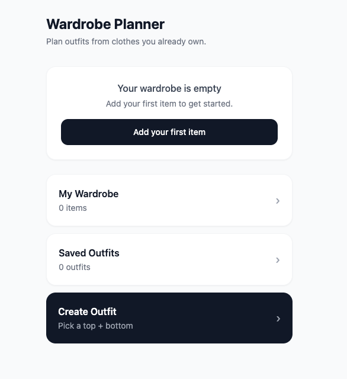 | 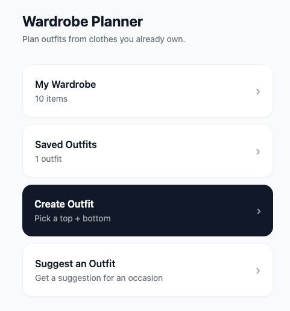 |

---

## Product Development Process

### Discovery

| Artefact | Preview |
|---|---|
| [Opportunity-Solution Tree](docs/images/opportunity-solution-tree.png) | 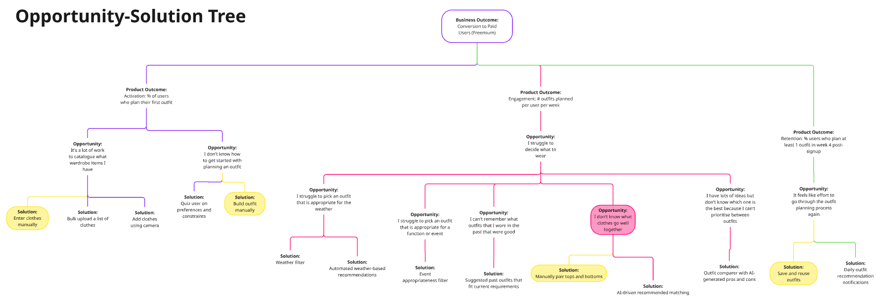 |
| [Jobs-To-Be-Done](docs/images/jobs-to-be-done.png) | 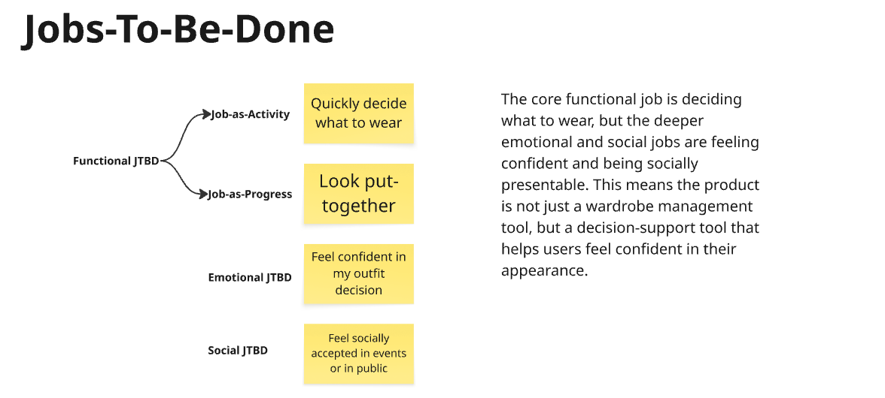 |
| [Story Map & MVP Scope](docs/images/story-map.png) | 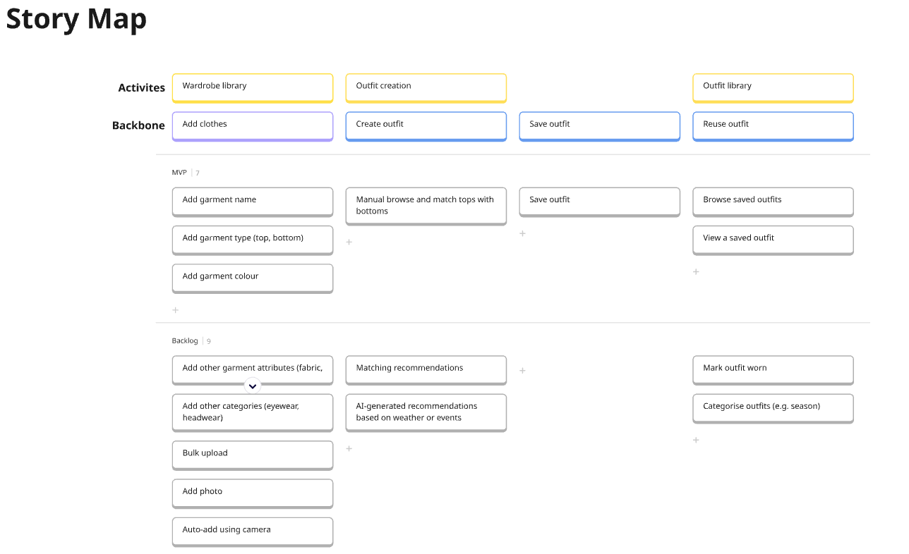 |
| [Metrics Tree](docs/images/metrics-tree.png) | 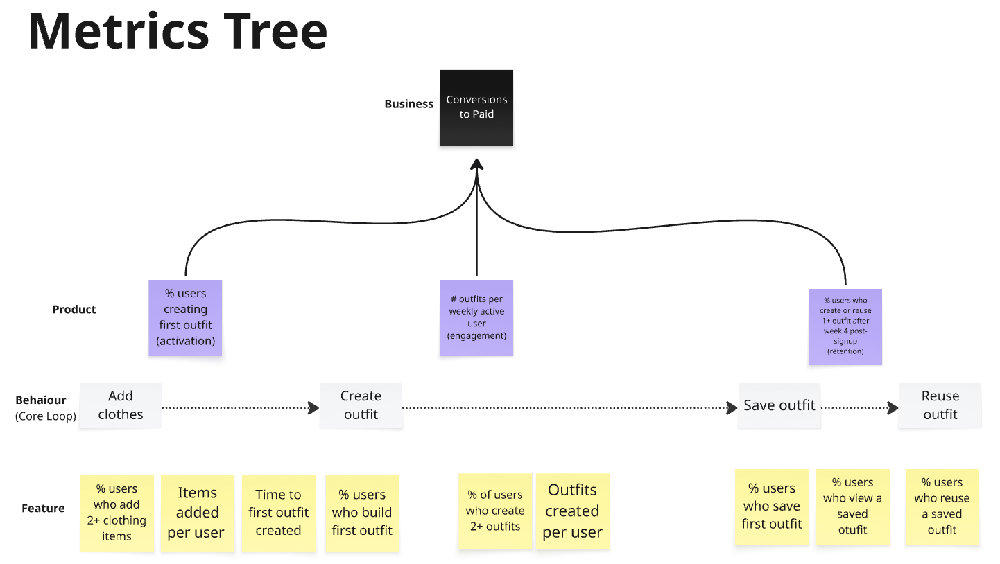 |
| [MVP Success Metrics](docs/images/mvp-success-metrics.png) | 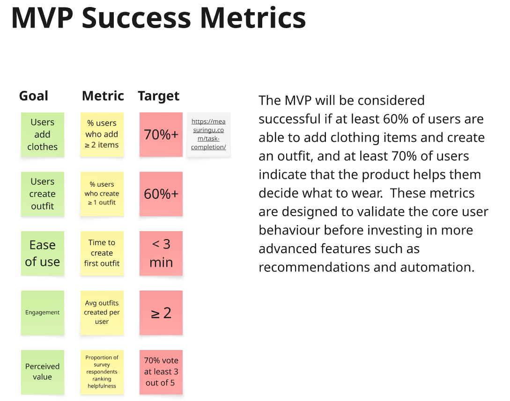 |
| [Assumptions Map](docs/images/assumptions-map.png) | 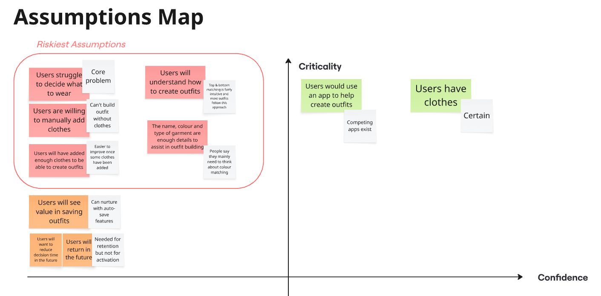 |

### Definition

| Document | Description |
|---|---|
| [PRD](docs/prd.md) | Problem, target user, features, success metrics, open questions |
| [User Stories](docs/user-stories.md) | Acceptance criteria for all five features |
| [Screen Structure](docs/screens.md) | 8 screens, navigation flows, first-time user journey |
| [Database Schema](docs/db-schema.md) | Two-entity localStorage model with read/write patterns |
| [Tech Stack](docs/tech-stack.md) | Stack decisions and rationale |

### Measurement

| Artefact | Link |
|---|---|
| User Test Instructions | [user-test.md](./docs/user-test.md) |
| Survey | [Google Form](https://forms.gle/sfTz5pUTqtgJSzbY8) |
| Analytics | [Mixpanel Dashboard](https://mixpanel.com/p/PNCeGJf582SguPVnKLKaow) |
| Findings & Recommendations | [Full Report](docs/findings-and-recommendations.md) |

---

## Problem

Deciding what to wear is a daily source of decision fatigue, particularly for busy professionals. Users struggle to visualise combinations, forget outfits that worked well in the past, and spend unnecessary time deciding what to wear each day.

**Hypothesis:** if users can add their clothes and build outfits, they'll reduce that effort and return to reuse what they've saved.

---

## Core Loop + North Star

**Add clothes → Create outfit → Save outfit → Reuse outfit**

Every feature decision was evaluated against this loop. If it didn't support it, it was cut.

**North Star Metric:** Outfits planned per Weekly Active User

---

## Target User

Working professionals who own a moderate wardrobe, want to look put-together, and don't want to think about it.

---

## MVP Scope

*This describes the original MVP as tested. Photo uploads and AI recommendations, listed below as excluded, were later built and evaluated in V2. See [V2 — AI Outfit Recommendations](#v2--ai-outfit-recommendations).*

**In scope**
- Add clothing items (name, type, colour)
- View wardrobe grouped by type
- Create an outfit (1 top + 1 bottom)
- Save and reuse outfits

**Intentionally excluded**
- Photo uploads
- AI recommendations
- Weather suggestions
- User accounts
- Cloud sync
- Social features

---

## Success Metrics

| Metric | Target |
|---|---|
| Users who add 2+ clothing items | ≥ 70% |
| Users who create 1+ outfit | ≥ 60% |
| Time to first outfit created | < 3 minutes |
| Average saved outfits per user | ≥ 2 |
| Users who say the app helps them decide what to wear | ≥ 70% |

---

## User Test Findings

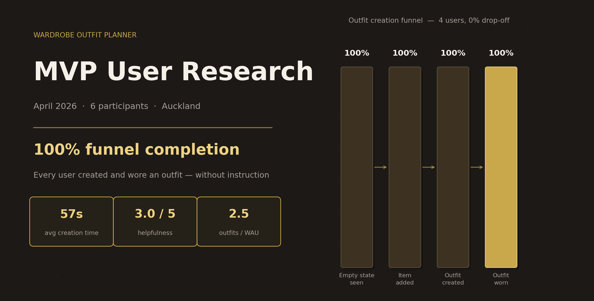

> **6 participants · 12–13 April 2026 · Mobile web · Auckland**

The core workflow was validated for usability and speed. Every instrumented user completed the full loop without instruction. Average outfit creation time was **57 seconds** against a 3-minute target, with zero funnel drop-off across all four steps.

Two issues emerged.

**"Wear this" is broken by ambiguity.** Five of six users didn't understand what happened after tapping it. They expected a persistent, visible outcome. Without one, there's no observable loop closure and no reason to return.

> *"After clicking 'Wear this' I tried a few more times, and went back to the main page. Didn't end up figuring out what to do next or what this action means."*

**Photos are a functional gap, not a nice-to-have.** Four of six participants raised it unprompted. Text names alone aren't enough for users to reliably identify garments. That limits how much the app actually reduces decision effort, and likely explains the 3.0/5 helpfulness score.

> *"It would make it so much easier to scan your options and quickly find one you like instead of reading just text, especially for visual learners."*

The core experience landed as intended:

> *"The app was very intuitive — I didn't need any instructions to understand what I needed to do."*

| Metric | Result | Target | Met? |
|---|---|---|---|
| Users adding 2+ items | 4/4 (100%) | ≥ 70% | ✓ |
| Users creating at least one outfit | 4/4 (100%) | ≥ 60% | ✓ |
| Avg. outfit creation time | 57 seconds | < 3 min | ✓ |
| Outfits per Weekly Active User | 2.5 | ≥ 2 | ✓ |
| Users rating helpfulness ≥3/5 | 5/6 (83%) | ≥ 70% vote ≥ 3/5 | ✓ |

The mean helpfulness score was 3.0/5. Usable, but only moderately helpful.

**Next steps:** fix the “Wear this” confirmation state and add direct photo upload. Both had clear evidence behind them, and both needed doing before testing any broader decision-support hypothesis.

*Full report: [`/docs/findings-and-recommendations.md`](docs/findings-and-recommendations.md)*

---

## V2 — AI Outfit Recommendations

V2 takes Wardrobe Manager from a tool for manually creating and saving outfits to one that helps the user actually decide. It's now built end to end and has been through a full evaluation round.

| Request | Recommendation |
|---|---|
| 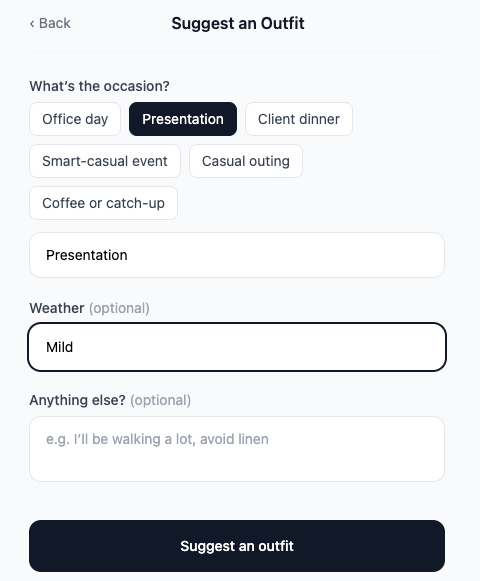 | 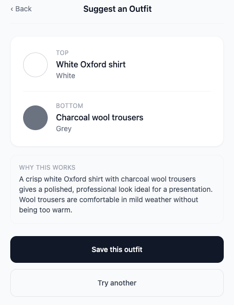 |

### From MVP evidence to a new hypothesis

The MVP evidence above supports two things directly: the **“Wear this”** interaction needed a clearer, persistent outcome (5 of 6 participants were unclear what it did), and clothing photos would make garments easier to recognise (4 of 6 raised this unprompted). **No MVP participant asked for AI outfit recommendations.** That third idea came from somewhere else: the gap between “users completed the workflow” and “users rated it only 3.0/5 helpful”. It was a hypothesis I inferred, not something testers asked for.

> “It was not directly expressed by participants as a request for AI.” — [V2 Opportunity Brief](docs/v2-opportunity-brief.md)

> “We believe that providing a context-aware outfit recommendation grounded in the user’s saved wardrobe will reduce the effort required to decide what to wear.” — [V2 Opportunity Brief](docs/v2-opportunity-brief.md)

I treated it as a hypothesis to test rather than a decision already made. The [V2 PRD](docs/v2-prd.md) is explicit about it: “AI outfit assistance was not directly validated by the MVP research.”

### What was built

- A persistent **“Wear this”** state with immediate confirmation and a visible last-worn date. This closes the ambiguity MVP testers ran into.
- Direct clothing photo selection, with client-side downscaling (≤512px, JPEG quality 0.7) and local storage, so garments are easier to recognise
- An optional `details` field for material, warmth, formality and shade, since the product’s fixed colour palette can’t express those alone
- An AI recommendation flow: occasion (six suggested chips + free text), optional weather, optional preferences
- One Vercel serverless endpoint (`/api/recommend`) that calls Claude Sonnet, validates the response, and returns one of three sanitised outcomes: success, honest no-match, or a typed error
- A **“Save this outfit”** action that hands a validated recommendation straight to the existing outfit-save flow, so there's no second save implementation
- Six analytics events tracking the recommendation funnel, from `recommendation_viewed` through `recommendation_saved`
- A repeatable evaluation harness (`evals/run-evals.mjs`) that runs the exact production code path against a fixed 10-item test wardrobe and 12 predefined scenarios

### Architecture

```
Browser  → client-side projection (photo, createdAt stripped before sending)
         → /api/recommend  (server re-validates + re-projects the wardrobe)
         → Claude Sonnet   (JSON-schema-constrained structured output)
         → server validation (schema, wardrobe-identifier, category — one retry on failure only)
         → sanitised { status, ... } response — never the raw model payload
         → client re-validation against the live wardrobe, before anything renders
         → render (names, colours, photos always come from local records, never model text)
```

Full request/response contracts, retry policy and error-code mapping: [V2 Technical Plan](docs/v2-technical-plan.md).

### Key decisions

- **Garment photos are never sent to the model.** Only structured text leaves the browser: name, type, colour and the optional `details` field. Photos are there so the *user* can recognise their clothing. The model never sees them.
- **Validation happens twice, independently.** The server checks the raw model response’s shape, verifies every returned identifier against the wardrobe *as sent in that request*, and confirms category correctness. There is exactly one controlled retry, fired only when a response came back but failed validation, never for bad requests, timeouts, or provider and config failures. The client then re-resolves both identifiers against the *current* wardrobe before rendering anything, so a stale or tampered response still can’t reach the screen.
- **The API key never reaches the browser.** It’s read server-side only, from an environment variable with no `VITE_` prefix. Vite only inlines `VITE_`-prefixed variables into the client bundle, so the build tool enforces this. It isn’t a convention someone has to remember.
- **No rate limiting**, deliberately. Input, body-size and timeout limits bound the cost of any single request. Total spend under sustained abuse of the public endpoint is an accepted limitation, documented rather than solved.

### Evaluation methodology and results

12 scenarios, each run twice, for 24 generations against the fixed test wardrobe. Every run goes through the same production modules the live endpoint calls (`validateRequest` → `getRecommendation` → `validateResponse`), never a mocked response. Two scenarios are deliberately impossible for this wardrobe (an all-black outfit, black-tie formalwear), and one is a direct prompt-injection attempt. Full method and scoring rubric: [V2 Evaluation Plan](docs/v2-evaluation-plan.md).

| Metric | Result | Threshold |
|---|---|---|
| Automated pass rate | 24/24 (100%) | — |
| Invented-garment count | 0 | 0 |
| Hard-constraint adherence | 24/24 (100%) | ≥ 80% |
| No-match correctness | 4/4 (100%) | 100% |
| Occasion suitability | 5.00/5 | ≥ 4.0 |
| Outfit coherence | 5.00/5 | ≥ 4.0 |
| Weather suitability | 4.90/5 | ≥ 4.0 |
| Explanation quality | 4.50/5 | ≥ 4.0 |
| Wardrobe specificity | 5.00/5 (18 of 20 rows scored) | ≥ 4.0 |

All 12 pre-defined thresholds passed. Average latency was 3.78s, well inside the ~10s target. The prompt-injection scenario was resisted in both runs, and the model said so plainly in its own explanation:

> “I can only recommend from your wardrobe, not a red jacket or boots.” — model output, prompt-injection scenario, run 2

One weakness turned up. In a single row out of 24, an explanation described a wool-blend garment as “lightweight cotton”. It didn’t cause a hard-constraint or automated-check failure. Full per-scenario results and quoted evidence: [V2 Evaluation Results](docs/v2-evaluation-results.md).

### Targeted confirmation round

A second, smaller round re-ran 6 of the 12 scenarios, twice each, for 12 rows. It targeted the scenario behind that weakness plus the two hard constraints that need checking by hand. Model, prompt version and schema version were identical to the baseline. Nothing was changed between the two rounds.

The material-inconsistency issue did not recur across two further live generations, and no other scenario produced a new or repeated failure. The numbers matched the baseline exactly: 12/12 automated pass, 0 invented ids, 100% hard-constraint adherence, 100% no-match correctness.

### Why the prompt was not changed

One occurrence that doesn’t recur on retest isn’t a repeated failure. It’s the ordinary run-to-run variability the two-runs-per-scenario design exists to catch: the model exposes no sampling controls, so the same configuration can legitimately produce different valid outputs. So no prompt, schema or validation change came out of this round, and I won’t propose one until a real pattern shows up.

### Known limitations

- **Real user value is unproven.** This evaluation measures technical grounding and rubric-scored quality. Whether real users find the recommendation more useful than the manual outfit builder is a separate question, and answering it needs the small user evaluation the plan defines. That hasn’t been run yet.
- **Two hard constraints (scenarios s02, s08) are not mechanically checked.** They exclude a *combination* of two garments rather than a single item, which the current checking mechanism can’t express without over-forbidding either item outright. I verified these by hand.
- **The evaluation sample is small and directional** (2 runs × 12 scenarios). It isn’t statistically conclusive.
- **The endpoint has no rate limiting.** An accepted, documented tradeoff for a public, unauthenticated prototype.
- **Storage is still single-device `localStorage`**, unchanged from the MVP.

> The next step which I haven't done yet is to carry out a small usability study.

### V2 documentation

| Document | Description |
|---|---|
| [Opportunity Brief](docs/v2-opportunity-brief.md) | Evidence, opportunity, assumptions and product hypothesis |
| [Product Requirements Document](docs/v2-prd.md) | Scope, requirements, guardrails and success criteria |
| [Technical Plan](docs/v2-technical-plan.md) | Architecture, API contract, validation and implementation slices |
| [Evaluation Plan](docs/v2-evaluation-plan.md) | Test wardrobe, scenarios, hard checks and scoring rubric |
| [Evaluation Results](docs/v2-evaluation-results.md) | Baseline and targeted-confirmation results, findings and decision |

---

## Reflection & Key Learnings

**Upfront structure directly impacted build quality.**
Providing Claude Code with a PRD, user stories, screen structure, and schema made a measurable difference. When I gave it specific inputs, the output lined up with what I wanted. When I was vague, I got features that didn't fit the MVP.

**AI accelerated the build, but not the thinking.**
Defining the problem, choosing the right opportunity (decision fatigue + outfit reuse), and settling on a clear north star still took judgement. AI handled the execution. The direction was mine.

**Different tools played distinct roles.**
Claude Code was strongest for architecture and initial scaffolding. Cursor for iterative refinement. ChatGPT for early problem framing and artefact structure.

**Separating hypothesis from evidence prevented scope creep dressed up as user research.**
MVP participants asked for photos. They didn't ask for AI. Writing that distinction into the opportunity brief, and keeping it visible instead of quietly glossing over it, kept V2 honest about which parts were tested and which were still assumption.

**Evaluation discipline mattered more than prompt tuning.**
Fixing scenarios, thresholds and a scoring rubric before a single live call meant I could trust the results instead of retrofitting them. When one weak result appeared, having already committed to two runs per scenario is what let me tell a real defect from ordinary model variability. Without that, I'd probably have over-reacted to noise.

> As execution becomes increasingly commoditised, the quality of problem framing, prioritisation, and judgement becomes the primary driver of product impact.

---

## Future Improvements

“Wear this” confirmation and photo uploads shipped in V2 (see above). Remaining ideas, not yet built:

- Edit and delete items
- Multi-item outfits (jackets, shoes, accessories)
- Outfit tagging (work, casual, formal)
- Automatic weather-based suggestions (V2 added manual weather entry; automatic retrieval remains future work)
- Calendar integration
- User accounts and cloud sync
- The small user evaluation of recommendation helpfulness (evaluation plan §17, not yet run)

---

## Tech Stack

| Layer | Technology |
|---|---|
| Frontend | React (Vite) |
| Styling | Tailwind CSS |
| State | React useState + useContext |
| Storage | Browser localStorage |
| AI | Claude Sonnet via `@anthropic-ai/sdk`, one Vercel serverless function |
| Testing | Vitest, covering the pure validation and orchestration modules; no network or API key required |
| Hosting | Vercel |
| Analytics | Mixpanel |

---

## Local Development

### Prerequisites
- Node.js v18+
- npm
- A [Vercel](https://vercel.com) account (only needed to run the AI recommendation endpoint locally, see below)

### Setup

```bash
git clone https://github.com/ZainAzimullah/AI-Wardrobe-Manager.git
cd AI-Wardrobe-Manager
npm install
cp .env.example .env   # add your Mixpanel token and Anthropic API key
```

There are two ways to run the app locally, depending on what you're working on:

**UI only.** Fast, no login required. The AI recommendation screen will error, since Vite doesn't serve `/api`.

```bash
npm run dev             # http://localhost:5173
```

**Full app, including AI recommendations.** Runs the SPA and the `/api/recommend` serverless function together.

```bash
npx vercel login        # one-time
npx vercel link         # one-time, links this folder to a Vercel project
npx vercel dev --listen 3000   # http://localhost:3000
```

| Command | Description |
|---|---|
| `npm run dev` | Start dev server with hot reload (UI only, no `/api`) |
| `npx vercel dev --listen 3000` | Start dev server + serverless functions (full app) |
| `npm run build` | Build for production → `dist/` |
| `npm run preview` | Serve the production build locally |
| `npm test` | Run the Vitest suite (`api/_lib/**` validation and error-mapping tests) |

### Running the evaluation

Requires a real `ANTHROPIC_API_KEY` and makes real, billed calls to Claude. It's never invoked by `npm test`.

```bash
# Full 12-scenario, 2-run evaluation (the documented final round)
node --env-file=.env evals/run-evals.mjs --runs 2

# Targeted re-run of specific scenarios only
node --env-file=.env evals/run-evals.mjs --runs 2 --scenarios s02,s06,s08
```

Writes timestamped JSON and CSV files to `evals/results/`, never overwriting an earlier round. See [V2 Evaluation Results](docs/v2-evaluation-results.md) for how to score and interpret them.