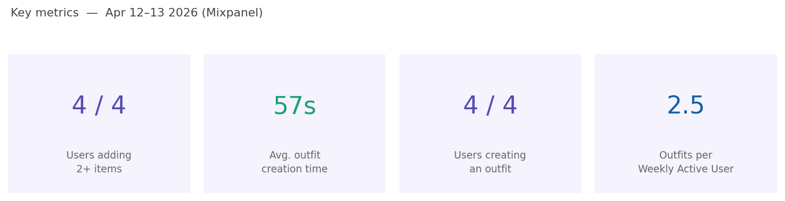

# Findings & Recommendations
**Wardrobe Manager — MVP**
*Testing period: 12–13 April 2026 | 6 participants*

---

## Methodology

Six participants tested the app on 12–13 April 2026 and completed a survey. The survey combined open-ended qualitative questions with a single 5-point Likert scale item measuring how much the app helped them decide what to wear. Mixpanel analytics data from four participants over the same 24-hour window supplements the survey findings. Two sessions were not captured in analytics due to instrumentation limitations, so behavioural insights are based on the subset of tracked users.

- [Survey](https://forms.gle/sfTz5pUTqtgJSzbY8)
- [Responses](Survey_Responses.csv)
- [Analytics (Mixpanel)](https://mixpanel.com/p/PNCeGJf582SguPVnKLKaow)

---

## Key Metrics

| Metric | Result | Target | Met? |
|---|---|---|---|
| Users adding 2+ items | 4/4 (100%) | ≥ 70% | ✓ |
| Users creating at least one outfit | 4/4 (100%) | ≥ 60% | ✓ |
| Avg. outfit creation time | 57 seconds | < 3 min | ✓ |
| Outfits per Weekly Active User | 2.5 | ≥ 2 | ✓ |
| Avg. helpfulness (Likert) | 3.0 / 5 | ≥ 70% vote ≥ 3/5 | ✓ |

---

## Funnel Performance

All 4 instrumented users passed through every step of the outfit creation funnel with zero drop-off.

---

## Finding 1 — The core loop is fast, functional, and easy to learn

The most consistent signal across all six responses was that the app was easy to pick up without instruction. The onboarding flow worked exactly as designed. Mixpanel confirms this behaviorally: all 4 instrumented users passed through every step of the funnel (empty_state_seen → item_added → outfit_created → outfit_worn) with zero drop-off, and the average time from starting the creation flow to saving an outfit was just 57 seconds — far under the 3-minute PRD target.

Qualitatively, the empty state CTA was specifically credited for getting users started:

> *"The nice call to action to get me to save my first item — once I did that the rest fell into place."*

> *"The app was very intuitive, I didn't need any instructions to understand what I needed to do."*

The colour-coding system also drew unprompted positive mentions from two respondents.

---

## Finding 2 — "Wear this" is the app's most significant UX failure

Five of six respondents expressed confusion about what the "Wear this" button actually did after tapping it. This is the single most important friction point in the current build. Users expected the action to do something observable — log a date, show a badge, confirm a state — but instead received no persistent feedback.

> *"After clicking 'Wear this' I tried a few more times, and also went back to the main page. Didn't end up figuring out what to do next or what this action means."*

> *"I assumed it would tell me what I am planning to wear for today via chip or badge or anything to indicate state — after that I assumed I'm supposed to remember."*

This is a direct threat to the `outfit_worn` event that underpins the retention metric. Users who don't understand the action won't return to repeat it.

---

## Finding 3 — The absence of photos is a meaningful barrier to utility

Four of six participants independently raised photo upload as missing, making it the single most requested feature. The core issue isn't aesthetic; it's functional identification. Users find it mentally effortful to recognise their clothing items from text alone, which undermines the app's core promise of reducing decision fatigue.

> *"It's hard to identify your clothing items by name — image would help."*

> *"Def needs a place to upload a picture of the outfit — it would make it so much easier to scan your options and quickly find one you like instead of reading just text, especially for visual learners."*

This also contextualises the 3.0/5 average helpfulness score. The core loop works mechanically, but without visual anchors, users struggle to connect app entries to real garments — limiting how much the app reduces actual decision effort.

---

## Finding 4 — Navigation depth and "Wear this" ambiguity suppress the helpfulness score

The 5-point Likert question returned a mean of **3.0**. Four of six respondents chose exactly 3 ("neutral"), with one scoring 4 and one scoring 2. No respondent scored it a 5.

Two factors explain this ceiling: the "Wear this" confusion (Finding 2), and a secondary complaint about navigation depth. One participant noted that *"everything being behind 3 menus feels a bit clunky"* — the path from Home to an outfit detail requires three taps, which compounds on repeat use. These are both fixable problems, not signs that the core value proposition is wrong.

---

## Finding 5 — Users are already projecting beyond MVP scope

Several respondents volunteered feature ideas that align with features already planned for post-validation: calendar integration (2 respondents), occasion tagging, wear history, accessories, and weather integration. This is an encouraging signal — it suggests users see a future with the product, not just a prototype. However, these should be treated as directional signals rather than build mandates. The "Wear this" problem and the photo gap are more urgent because they undermine the current MVP's core jobs.

---

## Recommended Actions

Ranked by impact on the North Star metric (outfits planned per WAU).

### Immediate (Pre-Rollout)

Clarify the "Wear this" interaction with visible confirmation state — a persistent badge, a "worn today" label, or a brief confirmation screen. This directly affects retention measurement.

### High priority (v2)

Introduce photo upload for clothing items. This is the most-requested feature and the most direct lever for improving the helpfulness Likert score.

### Low priority (Post-Validation)

- Basic edit/delete for clothing items (2 respondents)
- Custom colour text input when "Other" is selected (1 respondent)
- Outfit naming accessible from the save screen (1 respondent — appears to be a bug where the name field wasn't surfaced)
