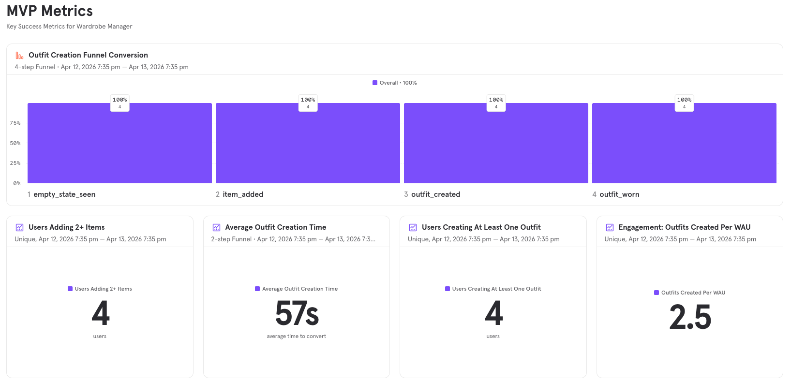
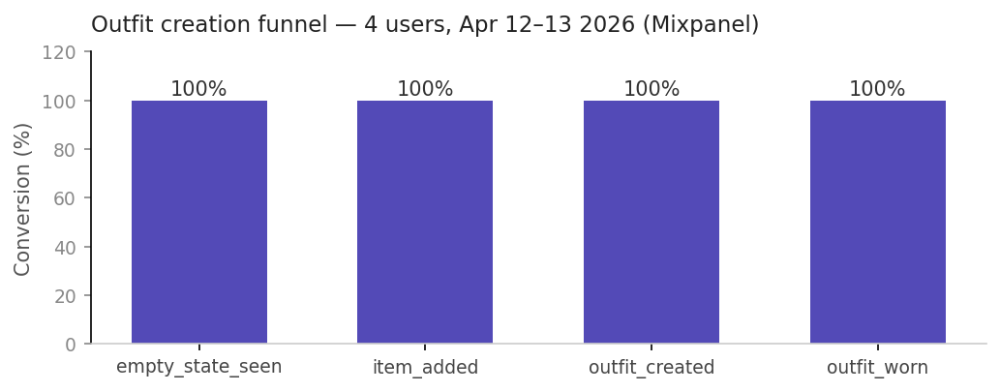
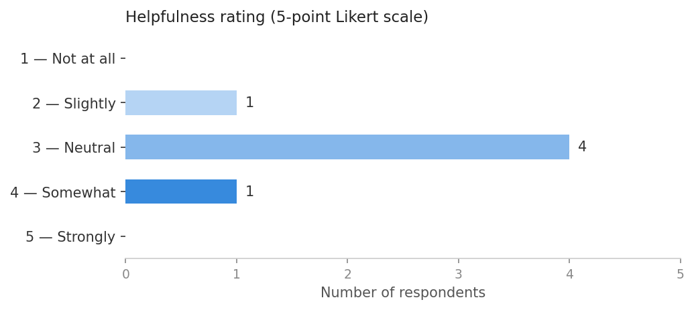
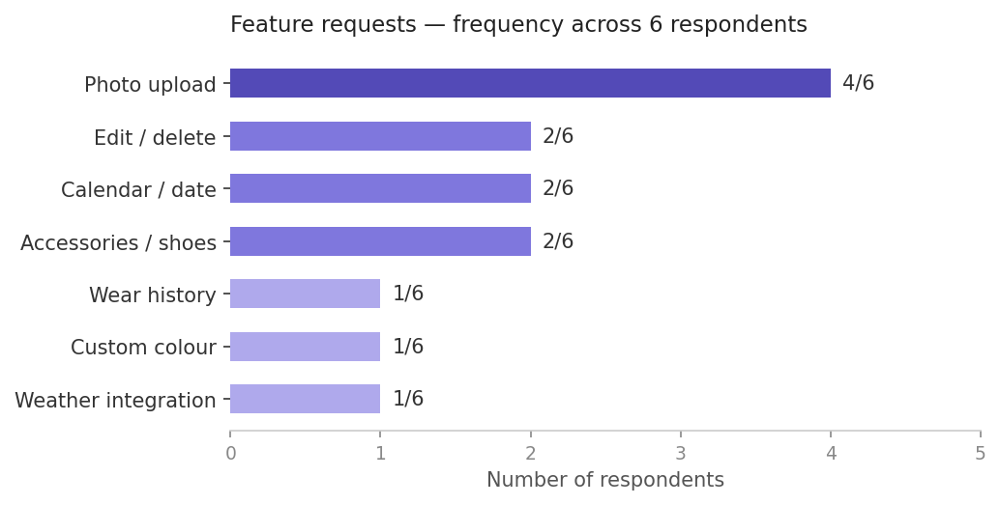

# User Research Summary
**Wardrobe Outfit Planner — MVP**
*Testing period: 12–13 April 2026 | 6 participants*

---

## Overview

Six participants tested the MVP on 12–13 April 2026. Four of them were instrumented with Mixpanel events.  The survey combined open-ended questions with a single 5-point Likert scale item. Mixpanel analytics data from the same 24-hour window supplements the qualitative findings.

| Metric | Result | PRD target |
|---|---|---|
| Participants | 6 | — |
| Users adding 2+ items | 4/4 (100%) | 70% |
| Users creating at least one outfit | 4/4 (100%) | 60% |
| Avg. outfit creation time | 57s | Under 3 min |
| Outfits per Weekly Active User | 2.5 | — |
| Avg. helpfulness (Likert) | 3.0 / 5 | — |

---

## Analytics: Core Loop Funnel

All 4 instrumented users passed through every step of the funnel with zero drop-off.

---

## Finding 1: The core loop is fast and easy to learn

The most consistent signal across all six responses was that the app was easy to pick up without instruction. The onboarding CTA was specifically credited for getting users started.

> *"The app was very intuitive — I didn't need any instructions to understand what I needed to do."*

> *"The nice call to action to save my first item. Once I did that, the rest fell into place."*

The colour system also drew unprompted positive mentions from two respondents. Behaviorally, Mixpanel confirms the story: 100% funnel completion and a 57-second average creation time.

---

## Finding 2: "Wear this" is the app's most significant UX failure

Five of six respondents expressed confusion about what the "Wear this" button did after tapping it. Users expected a persistent, observable outcome, such as a badge, a confirmed state, or some kind of record. Instead, they received no visible feedback.

> *"After clicking 'Wear this' I tried a few more times, and went back to the main page. Didn't end up figuring out what to do next or what this action means."*

> *"I assumed it would tell me what I am planning to wear for today via chip or badge. After that I assumed I'm supposed to remember."*

This is a direct risk to the retention metric. Users who do not understand the action will not return to repeat it.

---

## Finding 3: The absence of photos limits real-world utility

Four of six participants independently raised photo upload as missing, making it the single most requested feature. The core issue is functional identification: users find it mentally effortful to recognise garments from text names alone, which undermines the app's core promise of reducing decision effort.

> *"It's hard to identify your clothing items by name — image would help."*

> *"Def needs a place to upload a picture. It would make it so much easier to scan your options and quickly find one you like instead of reading just text, especially for visual learners."*

This likely explains the 3.0/5 helpfulness score. The loop works mechanically, but without visual anchors, users struggle to connect app entries to real garments.

---

## Finding 4: Navigation depth is a secondary friction point

One participant noted that reaching an outfit detail requires passing through three menus, which felt clunky on repeat use.

> *"Everything being behind 3 menus feels a bit clunky."*

This compounds the "Wear this" confusion: users who do not understand the outcome of an action are also being asked to navigate back through several screens to try again.

---

## Helpfulness Rating

The mean score of 3.0 reflects a ceiling caused primarily by the "Wear this" confusion (Finding 2) and the absence of photos (Finding 3). No respondent scored it a 5. Both factors are fixable.

---

## Feature Requests

Several respondents volunteered ideas that align with features already planned for post-validation: calendar integration, occasion tagging, wear history, and weather integration. This is an encouraging signal that users see a future with the product. However, these should be treated as directional input only. The "Wear this" problem and the photo gap are higher priority because they undermine the current MVP.

---

## Recommended Actions

Ranked by expected impact on the North Star metric (outfits planned per WAU).

**Immediate (before wider rollout)**
- Clarify the "Wear this" interaction with a visible, persistent confirmation state: a badge, a "worn today" label, or a brief confirmation screen. This directly affects retention measurement.

**High priority (v2)**
- Add photo upload for clothing items. The most-requested feature and the most direct lever for improving the helpfulness score.

**Lower priority (v2 or later)**
- Basic edit/delete for items (2 respondents)
- Outfit naming surfaced at save time: one respondent could not name their outfit, which appears to be a bug rather than a missing feature
- Custom colour text input as a fallback when "Other" is selected (1 respondent)
